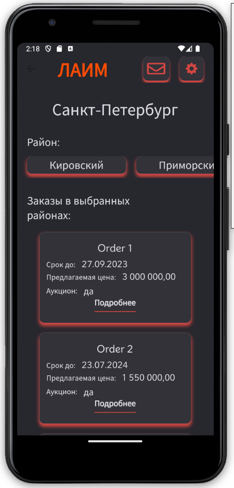
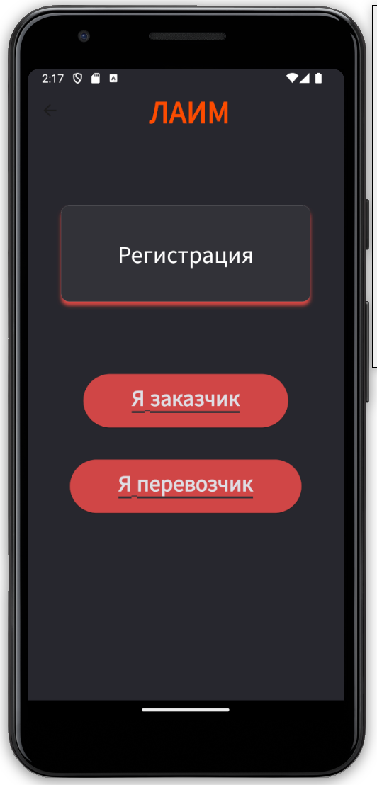
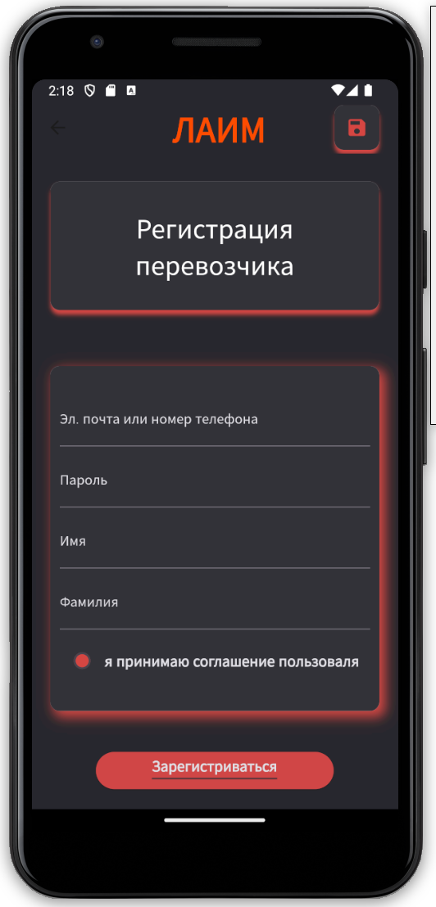
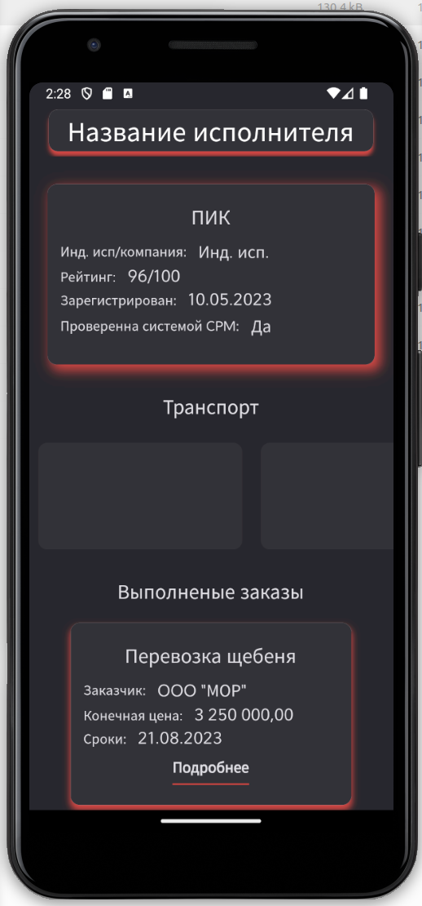
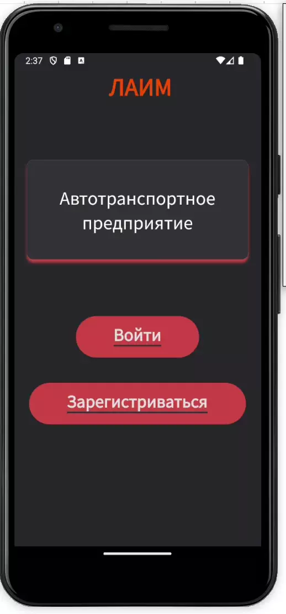

# Freight carrier aggregator.

> The screens of aggregator aggregator cargo transportation for customers and contractors on Flutter.

---

[Description](#description) •
[Project setup](#project-setup) •
[Features](#features) •
[How To Use](#how-to-use) •
[Project Status](#project-status) •
[Room for Improvement](#room-for-improvement) •
[License](#license) •
[Contact](#contact)

## Description

Freight carrier aggregator screens.

## Project setup

- Clone this repo to your desktop.
- May be needed run `flutter packages get` or click Get packages button in IDE to install all the dependencies.
- Launch the emulator or connect your smartphone.
- Run the application in your IDE (Run -> Run Without Debugging for VSCODE).
- Enjoy.

## Features

- svg icons.
- Google fonts.

## How To Use

## Project Status

Project is: _completed_

## Room for Improvement

To do:

- [ ] Implement cars views widget.

Improvement:

- [ ] Add i18next.
- [ ] Implement toggle day-night.

## License

This project available under the [LICENSE](../LICENSE.txt).

## Contact

Created by [@RimidalU](https://www.linkedin.com/in/uladzimir-stankevich/) - feel free to contact me!

<!-- MARKDOWN LINKS & IMAGES -->

<!-- [tutorial]: ./assets/demo.webp -->
